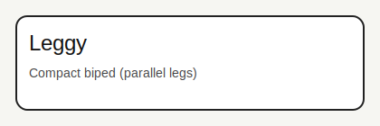
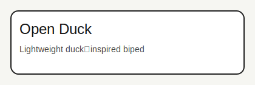
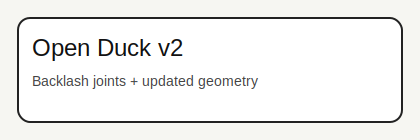
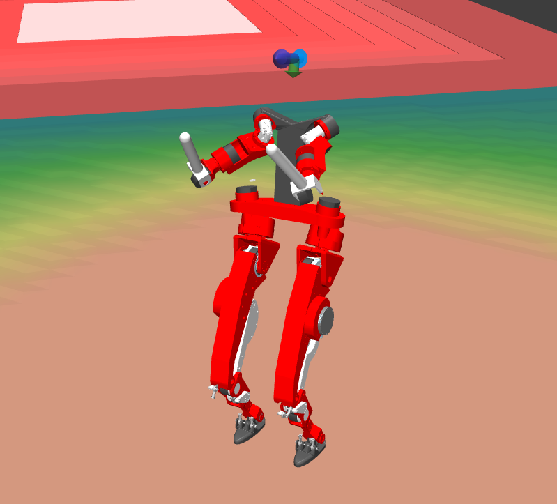
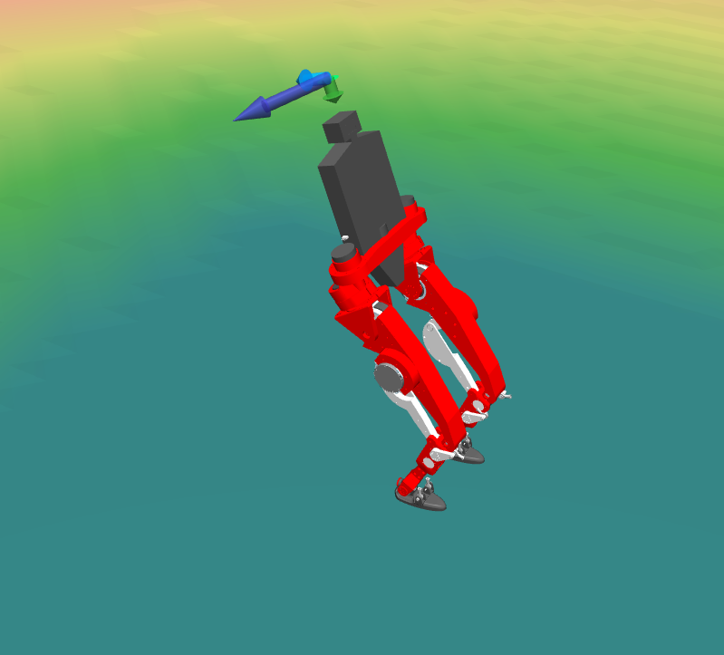

# lerobot-legged-zoo

This repo contains legged robot models (MJCF + assets) and MJLab training examples.
It is meant to be run from the repo root with `uv`, and registers tasks through the
`training_exemples` package.

Status notes:
- LeRobot Humanoid is in development.
- Leggy is a WIP concept and does not exist as hardware yet.

## How It Fits Together

- **Models** (`models/`): MJCF files + assets (meshs, sensors, scenes). This is the
  ground‑truth robot description used by MuJoCo.
- **Constants** (`training_exemples/*/*_constants.py`): lightweight python helpers
  that load the MJCF, set initial pose, actuators, collisions, and asset packaging.
- **Training configs** (`training_exemples/*/env_cfgs.py`): environment settings
  (terrain, rewards, observations, commands). This is where you tune the cost function.

## Repo Layout

- `models/`: robot MJCF files and assets (meshs, sensors, scenes)
- `training_exemples/`: MJLab task registrations and env configs
- `pyproject.toml`: dependency and entry point setup
- `media/`: images/videos used in this README

## Installation

This project uses `uv` for dependency management.

## Hardware Requirements

- A CUDA-capable GPU is required to run training and play commands.

```bash
uv sync
```

## Run Training

Pick any task id from the table below.

```bash
# Train with default settings
uv run train Mjlab-Velocity-Flat-Open-Duck-v2

# Adjust number of parallel environments
uv run train Mjlab-Velocity-Flat-Open-Duck-v2 --env.scene.num-envs 2048

# See all options
uv run train Mjlab-Velocity-Flat-Open-Duck-v2 --help
```

## Run Play/Evaluation

```bash
# Play with a wandb checkpoint
uv run play Mjlab-Velocity-Flat-Open-Duck-v2 --wandb-run-path <your-wandb-path>

# Play with a local checkpoint
uv run play Mjlab-Velocity-Flat-Open-Duck-v2 --checkpoint-file logs/rsl_rl/open_duck_v2/<run>/model_*.pt

# Use random actions (sanity check)
uv run play Mjlab-Velocity-Flat-Open-Duck-v2 --agent random
```

## Available Tasks

| Task Name | Description |
|-----------|-------------|
| `Mjlab-Velocity-Flat-Leggy` | Train Leggy to walk on flat ground |
| `Mjlab-Velocity-Rough-Leggy` | Train Leggy to walk on rough terrain |
| `Mjlab-Velocity-Flat-Open-Duck` | Train Open Duck to walk on flat ground |
| `Mjlab-Velocity-Rough-Open-Duck` | Train Open Duck to walk on rough terrain |
| `Mjlab-Velocity-Flat-Open-Duck-v2` | Train Open Duck v2 to walk on flat ground |
| `Mjlab-Velocity-Rough-Open-Duck-v2` | Train Open Duck v2 to walk on rough terrain |
| `Mjlab-Velocity-Flat-LeRobot-Humanoid` | Train LeRobot Humanoid to walk on flat ground |
| `Mjlab-Velocity-Rough-LeRobot-Humanoid` | Train LeRobot Humanoid to walk on rough terrain |
| `Mjlab-Velocity-Flat-LeRobot-Humanoid-full` | Train LeRobot Humanoid (full) on flat ground |
| `Mjlab-Velocity-Rough-LeRobot-Humanoid-full` | Train LeRobot Humanoid (full) on rough terrain |
| `Mjlab-Velocity-Flat-LeRobot-Humanoid-no-arms` | Train LeRobot Humanoid (no arms) on flat ground |
| `Mjlab-Velocity-Rough-LeRobot-Humanoid-no-arms` | Train LeRobot Humanoid (no arms) on rough terrain |

## Robots (Details)

Each robot has a model folder under `models/` and a matching training example under
`training_exemples/`. These are the main entry points you will edit.

### Leggy
- Model: `models/leggy/robot.xml`
- Training: `training_exemples/leggy/env_cfgs.py`
- Constants: `training_exemples/leggy/leggy_constants.py`
- Tasks: `Mjlab-Velocity-Flat-Leggy`, `Mjlab-Velocity-Rough-Leggy`
 - Small biped with parallel legs, designed for compact locomotion experiments.


### Open Duck
- Model: `models/open_duck/robot.xml`
- Training: `training_exemples/open_duck/env_cfgs.py`
- Constants: `training_exemples/open_duck/open_duck_constants.py`
- Tasks: `Mjlab-Velocity-Flat-Open-Duck`, `Mjlab-Velocity-Rough-Open-Duck`
 - Small duck‑inspired biped, lightweight and easy to iterate on.


### Open Duck v2 (Backlash)
- Model: `models/open_duck_v2/open_duck_v2_backlash.xml`
- Training: `training_exemples/open_duck_v2/env_cfgs.py`
- Constants: `training_exemples/open_duck_v2/open_duck_v2_constants.py`
- Tasks: `Mjlab-Velocity-Flat-Open-Duck-v2`, `Mjlab-Velocity-Rough-Open-Duck-v2`
 - Updated Open Duck with backlash joints and improved geometry.


### LeRobot Humanoid (12-DOF)
- Model: `models/bipedal_plateform/mjcf/robot.xml`
- Training: `training_exemples/lerobot_humanoid/env_cfgs.py`
- Constants: `training_exemples/lerobot_humanoid/lerobot_humanoid_constants.py`
- Tasks: `Mjlab-Velocity-Flat-LeRobot-Humanoid`, `Mjlab-Velocity-Rough-LeRobot-Humanoid`
- 12‑DOF lower‑body humanoid for fast velocity‑tracking experiments.
<video src="media/lerobot_humanoide.mp4" controls width="640">
Your browser does not support the video tag.
</video>

### LeRobot Humanoid Full (20-DOF)
- Model: `models/lerobot_humanoide/mjcf/robot.xml`
- Training: `training_exemples/lerobot_humanoid_full/env_cfgs.py`
- Constants: `training_exemples/lerobot_humanoid_full/lerobot_humanoid_full_constants.py`
- Tasks: `Mjlab-Velocity-Flat-LeRobot-Humanoid-full`, `Mjlab-Velocity-Rough-LeRobot-Humanoid-full`
 - Full humanoid with upper‑body joints for whole‑body control research.


### LeRobot Humanoid No-Arms
- Model: `models/bipedal_plateform_no_arms/mjcf/robot.xml`
- Training: `training_exemples/lerobot_humanoid_no_arms/env_cfgs.py`
- Constants: `training_exemples/lerobot_humanoid_no_arms/lerobot_humanoid_no_arms_constants.py`
- Tasks: `Mjlab-Velocity-Flat-LeRobot-Humanoid-no-arms`, `Mjlab-Velocity-Rough-LeRobot-Humanoid-no-arms`
 - Lower‑body‑only humanoid variant without arms.


## Modify Rewards / Cost Function

Each task is registered in `training_exemples/<robot>/__init__.py`, and the
environment configuration lives in `training_exemples/<robot>/env_cfgs.py`.

The reward (cost) terms are under `cfg.rewards`:

```python
# Example: change weights
cfg.rewards["upright"].weight = 1.0
cfg.rewards["body_ang_vel"].weight = -0.05

# Example: add a new cost term
from mjlab.managers.reward_manager import RewardTermCfg
from mjlab.tasks.velocity import mdp

cfg.rewards["self_collisions"] = RewardTermCfg(
  func=mdp.self_collision_cost,
  weight=-1.0,
  params={"sensor_name": "self_collision"},
)
```

Common places to edit:
- `training_exemples/*/env_cfgs.py`: reward weights, command ranges, terrain settings
- `training_exemples/*/*_constants.py`: robot initialization, actuators, collision config

After edits, rerun your task with `uv run train ...` and the changes take effect.


## Resources

- MJLab: https://github.com/mujocolab/mjlab
- MuJoCo docs: https://mujoco.readthedocs.io/
